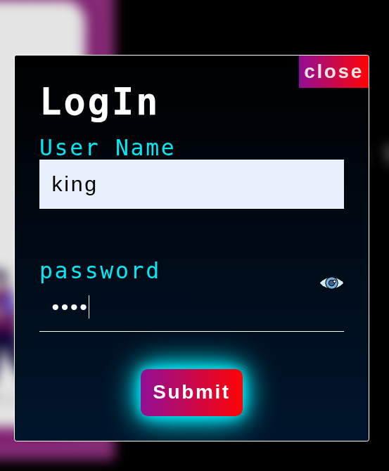
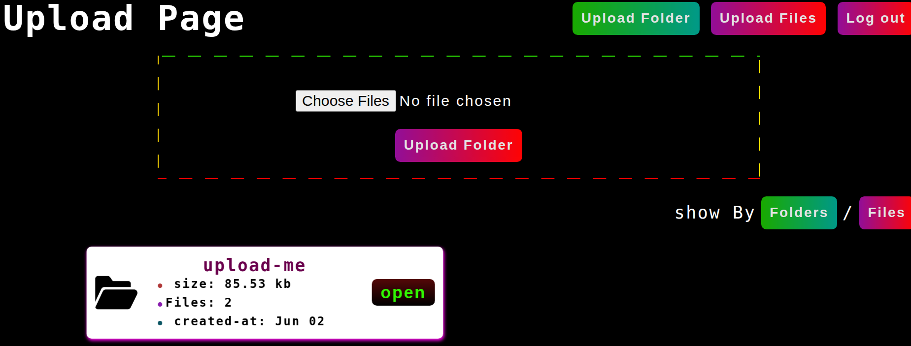
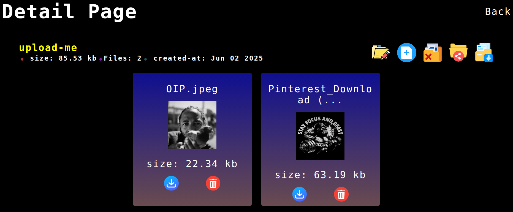

# File - Uploader solution

This is a solution to the [file-uploader challenge from TOP ](https://www.theodinproject.com/lessons/nodejs-file-uploader).

## Table of contents

- [Overview](#overview)
  - [The challenge](#the-challenge)
  - [Screenshot](#screenshot)
  - [Links](#links)
- [My process](#my-process)
  - [Built with](#built-with)
  - [What I learned](#what-i-learned)
  - [Continued development](#continued-development)

## Overview

### The challenge

- Authenticate users to be able upload files.
- users should able to create,edit and delete folders.
- Add file in the uploaded folder.

# Bonus(Extra-credit)

- Add share folder functionality to share folder for public using link with expiration time.

### Screenshot

### Links

- Live Site URL: []

## My process

- first time learning about using ORM(object relational map) and using prisma in database to make queries simple.

### Built with

- Semantic HTML5 markup
- CSS
- ejs

- node
  - psql
    -prisma
    -passport
    -express
    -express-validator
    -express-session
    -supabase
    -multer

### What I learned

- I learned to use prisma to manage database.
- using multer to read files before uploading them.
- Hashing files name before uploading them to supabase.
- using supabase to upload files and retrieve them.
- sharing links to public.

### Continued development

- learning more about uploading files and using ORM in the database properly.
- learning more about streams in node.
